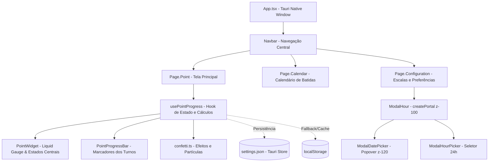

# onPoint

<p align="center">
  
</p>

> Bata o ponto no horário certo. Sem esquecer.</strong><br />
  Aplicativo inteligente e elegante para Windows, Ubuntu e Archlinux desenvolvido com Tauri, React e Tailwindcss.

---

## Visão Geral

O **onPoint** é um assistente de ponto flutuante de alta precisão que transforma a gestão de horários de trabalho em uma experiência visual intuitiva e recompensadora. Utilizando uma interface líquida interativa, o aplicativo exibe a subida contínua da água em direção à próxima batida, assume a tela cheia no momento exato do registro e celebra o encerramento do dia com chuva de confetes e estrelas. ✨.

---

## Principais Funcionalidades

### 1. Monitoramento Diário e Liquid Gauge
- **Relógio 24h em Tempo Real**: Formato militar (`HH:MM`) sincronizado a cada segundo.
- **Visualizador Líquido Fluido**: Ondas senoidais animadas que sobem de $0\%$ a $100\%$ proporcionalmente ao tempo decorrido entre os turnos.
- **Detecção Inteligente de Folga**: Exibe o ícone animado de descanso (*CupSoda*) com aviso *"Sem expediente / Dia de folga"* em dias sem escala cadastrada.

### 2. Modo Bater Ponto em Tela Cheia (100% Window Take-Over)
- **Ativação Automática**: Ao atingir o horário da batida ou $100\%$ da água, a interface inteira se converte em uma tela de foco imersiva (`fixed inset-0 z-50`).
- **Leitor Biométrico Interativo (`FingerprintIcon`)**:
  - Traçado vetorial com efeito de escaneamento a laser que se completa ($0 \rightarrow 100\%$) ao pressionar o botão.
  - Fixação no último frame preenchido.
  - Interação unificada de clique (`group-press`) entre o círculo do leitor e o botão *"Bater ponto agora"*.
- **Abertura do Sistema Externo**: Integração nativa com o navegador padrão através do `@tauri-apps/plugin-opener`.

### 3. Motor de Celebrações e Micro-Partículas
- **Batidas Intermediárias (1ª, 2ª e 3ª)**: Efeito de borrifo de água (*Water Splash*) com gotas azuis circulares (`#25586A` e `#ACEBF0`).
- **Última Batida (4ª / Fim da Jornada)**: Canhões duplos de confetes em tela cheia com **estrelas douradas ✨** e badge de conclusão com estrela inclinada (*"De hoje tá pago ⭐"*).

### 4. Gestão de Escalas e Horários
- **Suporte a Múltiplos Turnos**: Configuração de até 4 batidas diárias (1° Entrada, 2° Saída, 3° Entrada, 4° Saída).
- **Seleção de Dias da Semana**: Popover inteligente com filtros rápidos (*Todos os dias*, *Segunda a Sexta*, *Finais de semana*).
- **Time Picker 24h**: Seletor com conversão automática e suporte total a formato 24 horas.
- **Portais React (`createPortal`)**: Modais isolados no `document.body` com gestão hierárquica de `z-index` (`z-[100]` no modal, `z-[120]` nos popovers).

### Navegação com Pílula Deslizante
- **Spring Physics**: Indicador ativo com curva elástica `cubic-bezier(0.34, 1.56, 0.64, 1)` e deslocamento contínuo calculado via hardware ($\text{translateX} = \text{activeIndex} \times 44\text{px}$).

---

## 🏗️ Arquitetura do Sistema



---

## Instalação e Execução

### Pré-requisitos
- [Node.js](https://nodejs.org/) (versão 18+)
- [Rust & Cargo](https://www.rust-lang.org/) (ferramenta Tauri 2)
- Bibliotecas do sistema (ex: `webkit2gtk-4.1`, `gtk3` no Linux)

### Comandos de Desenvolvimento

```bash
# 1. Instalar as dependências do projeto
npm install

# 2. Executar no Arch Linux / Wayland (com aceleração gráfica otimizada)
npm run tauri:arch

# 3. Executar em outras distribuições Linux / X11 / Windows
npm run tauri dev

# 4. Validar tipos TypeScript e compilação do front-end
npm run build

# 5. Gerar o executável nativo de produção
npm run tauri build
```

> **Nota para Wayland/Arch Linux:** O comando `npm run tauri:arch` configura automaticamente as variáveis de ambiente `WEBKIT_DISABLE_DMABUF_RENDERER=1` e `GDK_BACKEND=x11` para evitar falhas de buffer gráfico no WebKitGTK.

---

## Estrutura de Diretórios

```
app.onPoint/
├── src/
│   ├── components/ui/         # Componentes visuais compartilhados (Navbar, Fingerprint, CupSoda, Popover)
│   ├── views/
│   │   ├── point/             # Módulo de Ponto (Liquid Gauge, Confetes, Barra de Progresso)
│   │   ├── configuration/     # Módulo de Configuração (Escalas, Modais, Time Pickers)
│   │   └── calendar/          # Módulo de Calendário de Batidas
│   ├── lib/                   # Utilitários gerais (Tailwind Merge, Classnames)
│   ├── App.tsx                # Janela principal do aplicativo
│   └── App.css                # Configurações de tema e Tailwind CSS 4
├── src-tauri/                 # Código nativo Rust, permissões e configurações do Tauri
├── docs/                      # Especificações funcionais e Design System
├── CHANGELOG.md               # Histórico detalhado de versões
└── README.md                  # Este documento
```

---

## Documentação Técnica por Módulo

> Toda pasta possui um README.md para melhor entendimento de toda a aplicação.

- 🗺️ **[Roadmap do Projeto (`ROADMAP.md`)](ROADMAP.md)**: Planejamento estratégico, fases de desenvolvimento e visão de futuro.
- 🌊 **[Módulo de Ponto (`src/views/point/README.md`)](src/views/point/README.md)**: Fórmulas de subida da água, celebrações e ciclo de vida das batidas.
- ⚙️ **[Módulo de Configuração (`src/views/configuration/README.md`)](src/views/configuration/README.md)**: Arquitetura de modais, portais, `z-index` e conversões de horário.
- 📅 **[Módulo de Calendário (`src/views/calendar/README.md`)](src/views/calendar/README.md)**: Futuramente será desenvolvido.
- 🎨 **[Componentes Compartilhados (`src/components/ui/README.md`)](src/components/ui/README.md)**: Catálogo detalhado de componentes, animações e props.
- 📐 **[Design System (`docs/DESIGN.md`)](docs/DESIGN.md)**: Tokens visuais, paleta de cores e tipografia.
- 📋 **[Especificação Técnica (`docs/SPEC.md`)](docs/SPEC.md)**: Decisões arquiteturais e escopo de entrega.

---

<p align="center">
  Desenvolvido por <strong>Isaac Machado</strong> · <a href="https://github.com/isaacmachado-dev">@isaacmachado-dev</a>
</p>
